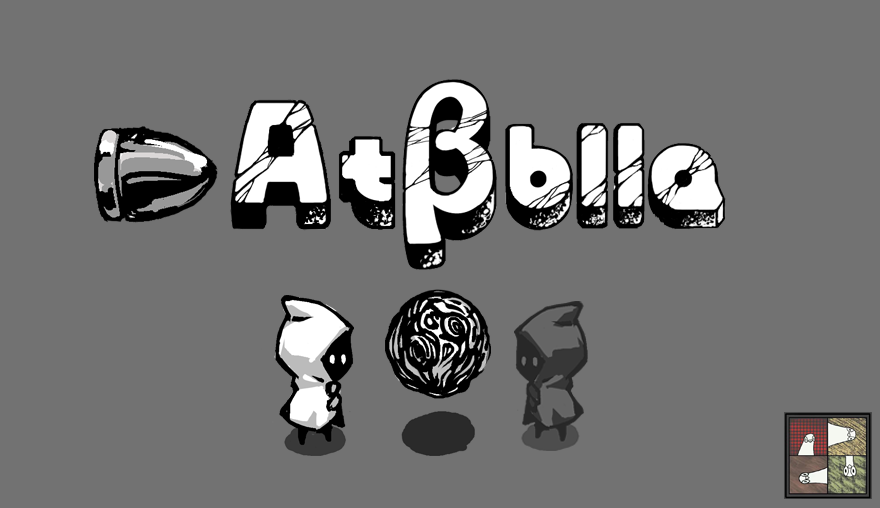

# 游戏介绍相关

## 团队名称

咕咕不咕 

**曾用名:POWERmove**

## 团队成员的名称、在团队中的职能、以及他们的机核网账号名称

| 名称           | 职能        | 机核账号名称 |
| -------------- | ----------- | ------------ |
| ZeaLotSean     | 啥都干/监工 | ZeaLotSean   |
| zxc            | 程序        | oosoraoo     |
| 李牧           | 美术        | 安东尼大爷   |
| LeoSSSSSSSSSSS | 关卡设计    | 硫酸酸铜     |
| IsayamaQB      | 游戏体验官  |              |

## 游戏名称

AtβЫla

## 游戏类型

(奇幻 / 冒险解密 / 单人)

## 游戏文件

## 

## 游戏项目安装说明、及足够让游戏项目运行的相关文件

## 游戏简短介绍（200-300 字左右）

首先感谢大家游玩我们的游戏

这个游戏最初的心态是大家一起体验一次GameJam

但是因为新冠疫情的原因, 线下GameJam的愿望泡汤了

我们是一只临时组建的团队

## 游戏图片(附件中也有附带源文件) 

### 横图

### 竖图

## 游戏内图片/gif

## 游戏介绍视频（非必须项）

暂无